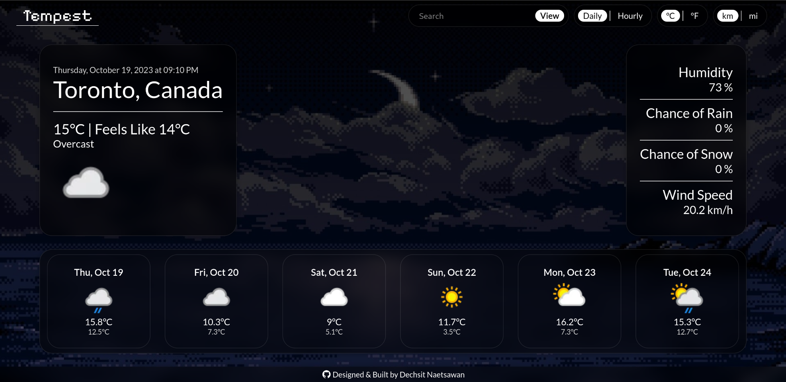

# Tempest : OdinProject Weather App

**Note:** The website is not mobile responsive.

This website was made for the OdinProject's Weather App assignment. The assignment's purpose was to  apply learn how to use an API and handle asynchronous code.

## Live Demo:
[Tempest](https://naetsawd.github.io/OdinProject-WeatherApp)

## About Website:
Tempest is a simple weather app that fetches all its data using the weatherAPI's free tier. IT features a search function, daily & hourly forecast as well as the ability to change the temperature and distance unites from metric to imperial individually. In addition, the website's background changes based on the time of day at the target location. Due to the usage of an API, the code is setup in a way that asynchronous code loads correctly and in order.

## Made Using:
- JavaScript
- HTML5
- CSS3
- Node.js
- Webpack and Other Node.js Modules
- WeatherAPI
